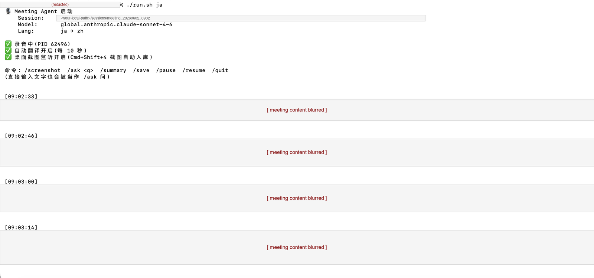

# Meeting Agent — 会议录音 + 实时翻译 + 截图汇总 + Q&A

独立运行的会议助手 CLI，跑在 Mac 上，本地 Whisper 转录 + AWS Bedrock Claude 翻译。

支持英文 → 中文、日文 → 中文。



> 截图示例（日语会议 → 中文翻译，转录内容已遮码）：启动信息 + 命令帮助 + 每段翻译的时间戳保留。

---

## 功能

- **本地转录**：用 `whisper-cpp` 在你电脑上跑，**音频不上云**
- **实时翻译**：英/日 → 中文，每 ~10 秒翻译一次新增内容
- **说话人推断**：可选 `participants.txt`，给模型参与者背景，让它在翻译时加 `[说话人]` 前缀
- **桌面截图自动入库**：会议中你 `Cmd+Shift+4` 截的图，agent 自动搬进 session 目录 + OCR + 中文总结
- **运行时 Q&A**：`/ask <问题>` 基于已转录内容直接问，中文回答
- **每次会议独立 session**：所有产物都在 `sessions/meeting_YYYYMMDD_HHMM/` 下

---

## ⚠️ 前置条件（必须有）

### 1. 系统
- **macOS**（依赖 macOS 的 Desktop 截图机制 + `whisper-cpp` 的 Mac 编译）
- **Apple Silicon 推荐**（M1/M2/M3，Whisper 跑 Metal 加速）
- 至少 **8GB RAM**（large-v3-turbo 模型需要 ~2GB 内存常驻）

### 2. AWS Bedrock
- AWS account 开启 **Bedrock 服务**
- 在 Bedrock console 启用 **Claude Sonnet 4.5+** 模型访问权限
- 配好 AWS profile（CLI 登录后能调 `bedrock:InvokeModel` 即可）
- 默认 region: `us-east-1`（你的 AWS profile 要在这个 region 启用了 Sonnet）

### 3. 系统权限授权（Mac → 系统设置 → 隐私与安全）
- ☑️ **麦克风** → 允许 Terminal（录音用）
- ☑️ **屏幕录制** → 允许 Terminal（`/screenshot` 命令用）
- ☑️ **文件与文件夹** → Terminal → 桌面文件夹（自动监听截图用）

### 4. 软件安装
```bash
# 4.1 Whisper-cpp（提供 whisper-stream 命令）
brew install whisper-cpp

# 4.2 ⭐ 下载 Whisper 模型 — 必须！brew 不会自动下载
WHISPER_DIR=$(brew --prefix whisper-cpp)
cd "$WHISPER_DIR/share/whisper-cpp/models"
bash "$WHISPER_DIR/share/whisper-cpp/download-ggml-model.sh" large-v3-turbo
# ↑ 1.6 GB 下载,几分钟

# 验证
ls -lh "$WHISPER_DIR/share/whisper-cpp/models/ggml-large-v3-turbo.bin"

# 4.3 Python 依赖
pip3 install boto3
```

**模型选择**（默认用 `large-v3-turbo`，速度+精度平衡）：

| 模型 | 大小 | 速度 (M1 Pro) | 精度 | 推荐 |
|---|---|---|---|---|
| `tiny` | 75 MB | 极快 | 差 | 测试 |
| `base` | 142 MB | 快 | 一般 | 测试 |
| `large-v3-turbo` | 1.6 GB | 快 | ★★★★ | ⭐ **默认** |
| `large-v3` | 3.1 GB | 慢 | ★★★★★ | 离线转录最准 |

下载其他模型同理：`bash download-ggml-model.sh <name>`。

如果用非默认模型，记得设环境变量：
```bash
export WHISPER_MODEL="$WHISPER_DIR/share/whisper-cpp/models/ggml-large-v3.bin"
```

### 5. 麦克风设备 index
不同 Mac 麦克风 index 不同。先列出可用设备：
```bash
whisper-stream --list
```
默认用 `1`（MacBook Pro 内置麦克风）。如果是外接耳机/USB mic，改 `agent.py` 顶部的 `WHISPER_DEVICE` 或设环境变量：
```bash
export WHISPER_DEVICE=2
```

---

## 启动

```bash
cd <path-to-meeting-agent>
./run.sh                  # 英文 → 中文 (默认)
./run.sh ja               # 日文 → 中文
./run.sh --no-translate   # 只录音不翻译
```

---

## 一次会议 = 一个 session 目录

```
meeting_agent/sessions/meeting_20260603_1338/
├── transcript.txt        whisper 原始英/日文转录(实时增长)
├── translation.md        中文翻译片段(每 ~25 秒追加一段)
├── final_summary.md      /save 命令生成
└── screenshots/
    ├── shot_133830_Screenshot 2026-06-03 at 13.38.30.png    (Cmd+Shift+4 截的)
    └── manual_133945.png                                     (/screenshot 命令截的)
```

---

## 截图怎么用

| 方式 | 怎么做 | 结果 |
|---|---|---|
| **Cmd+Shift+4**（推荐）| 平时怎么截屏就怎么截（默认存桌面）| Agent 检测到桌面新增图 → 搬进 session/screenshots → 自动 OCR + 中文总结 |
| **Cmd+Shift+3** | 全屏截图 | 同上 |
| `/screenshot` 命令 | 在 agent prompt 里输入 | 触发框选 → 直接存进 session 目录 |

**自动监听原理**：agent 启动后记录桌面已有截图，每 2 秒扫一次，**只处理之后新增的** —— 不会动你之前的截图。

---

## 运行时命令

| 输入 | 作用 |
|---|---|
| `/screenshot` | 框选屏幕 → 入库 + LLM 总结 |
| `/ask <问题>` 或直接打字 | 基于已转录内容提问（中文回答），自动暂停翻译，答完恢复 |
| `/summary` | 把翻译片段汇总成完整中文纪要 |
| `/save` | 写到 `final_summary.md` |
| `/pause` / `/resume` | 暂停/恢复自动翻译流（录音不停）|
| `/quit` 或 `Ctrl+C` | 停录音 + 退出 |

---

## 可选：参与者上下文（提升说话人识别）

复制 `participants.example.txt` → `participants.txt`，按格式填写本次会议参与者背景：
```
- **Alice**: 技术 lead，关心架构和 schema 设计
- **Bob**: backend 工程师，谈数据流和性能
- **Carol**: PM，关心 timeline 和 milestone
- **我**: 我从 APAC 时区 join
```

agent 启动时自动读这个文件 → 翻译时会加 `[Alice]`、`[Bob?]`（不确定加 `?`）前缀。

⚠️ `participants.txt` 默认 gitignored（含真实姓名），只有 `participants.example.txt` 是模板。

---

## 翻译局限性 ⚠️

### 英文 → 中文（en → zh）

#### 表现还行的场景
- ✅ 普通技术讨论：架构、schema、API 设计
- ✅ 标准商务英语：timeline、milestone、scope
- ✅ 印度/日本/欧洲口音的英语（whisper-large-v3-turbo 支持广泛）
- ✅ Native speaker 的连续讨论

#### 容易出问题的场景
- ❌ **专有名词缩写翻错**：当含义有歧义时（比如 `MQ` 是 Message Queue 还是别的），靠 `participants.txt` 给上下文
- ❌ **跨人对话很快时说话人识别会乱**：3-4 人快速 ping-pong，模型可能贴错 `[说话人]`
- ❌ **Whisper 静音幻觉**：会议没人说话时，whisper 偶尔输出 "Thank you for watching"、"字幕由..." 等训练数据残留 → 翻译流会跳过这类
- ❌ **Whisper 重复输出**：同一句话经常被识别 2-3 次（语音流尾巴重叠），翻译时会去重但不完美
- ❌ **数字 + 单位**：whisper 经常把 "twenty five" 识别成 "25"、把 "two point five" 识别成 "2.5"，但**百分比、货币偶尔错位**
- ❌ **中英混说**：当 native Chinese speaker 中英混说时，whisper-en 模型对中文部分识别为乱码英文 → 翻译变成 hallucination
- ❌ **跨多个 chunk 的句子**：每 10 秒一段翻译，长句子被切到不同 chunk 时上下文丢失

### 日文 → 中文（ja → zh）

#### 表现还行的场景
- ✅ 标准 NHK-style 会议日语：清晰、慢、礼貌体
- ✅ 一对一深度技术讨论
- ✅ 单人 presentation

#### 容易出问题的场景
- ❌ **关西腔/方言**：whisper-large-v3 对方言识别率明显下降
- ❌ **会议常见的助词省略 + 暧昧表达**：日语商务习惯"は～と思いますが…"省略主语，AI 翻译有时**自作主张补主语**（可能错）
- ❌ **填充词漏识别**："えーと/あの/まあ/はい" 这些在 prompt 里要求略过，但偶尔会被翻成无意义中文
- ❌ **专业术语日英混说**：日本工程师常说 "そのアーキテクチャの latency は…" → whisper-ja 模型对英文部分识别错率较高
- ❌ **敬语层级丢失**：尊敬語/謙譲語/丁寧語 在中文翻译里全变成普通中文，**职级关系信息丢失**
- ❌ **数字读法歧义**：日语数字 "ひゃく/せん/まん" 偶有识别错位
- ❌ **whisper 静音幻觉更严重**：日语模型容易冒出 "ご視聴ありがとうございました"、"字幕"、"提供" 等 YouTube 训练数据残留 → 已在 prompt 里要求跳过，但有漏网

### 通用局限

- 🟡 **延迟**：每段翻译 ~10 秒后才出现，**不适合实时同传**
- 🟡 **连续性**：每个 chunk 独立翻译，跨 chunk 的代词/指代关系容易丢
- 🟡 **专有名词不一致**：同一个产品名/人名，不同 chunk 翻译可能拼写不一致
- 🟡 **ASR 错就全错**：whisper 识别错了，翻译就肯定错（垃圾进，垃圾出）
- 🟡 **Bedrock cost**：每 10 秒调一次 Claude Sonnet，1 小时会议大概 ~$0.5-2 USD
- 🟡 **Whisper 模型语言锁定**：`--lang en` 模式下中文/日文听不见，反之亦然 → 启动前要选对

---

## 改参数

```bash
./run.sh --model anthropic.claude-sonnet-4-5-20250929-v1:0
./run.sh --no-translate            # 只录音不翻译
./run.sh --no-screenshot-watch     # 关闭桌面截图监听
./run.sh --profile your-profile    # 用其他 AWS profile
```

环境变量也行：
```bash
export AWS_PROFILE=your-profile
export AWS_REGION=us-east-1
export BEDROCK_MODEL=anthropic.claude-sonnet-4-5-20250929-v1:0
export WHISPER_DEVICE=2
./run.sh
```

---

## 默认配置（`agent.py` 顶部可改）

| 项 | 默认值 |
|---|---|
| 麦克风 device | `1`（内置 mic）|
| Whisper 模型 | `ggml-large-v3-turbo`（速度 + 准确度平衡）|
| Bedrock model | `anthropic.claude-sonnet-4-5-20250929-v1:0` |
| AWS profile / region | `default` / `us-east-1` |
| 自动翻译间隔 | 10 秒（详细翻译，逐句不总结）|
| 截图监听间隔 | 2 秒 |

---

## 安全 / 隐私

- ✅ 音频留在本地（whisper-cpp 离线推理）
- ⚠️ 转录文本 + 截图会上传到 **AWS Bedrock**（你 profile 配置的 account/region）
- ⚠️ Sessions 含会议原文，**不要分享 sessions 目录**到公网
- ✅ `.gitignore` 默认排除 `sessions/` 和 `participants.txt`
- ⚠️ 用之前确认你公司允许把会议内容发给你 AWS Bedrock

---

## 常见问题

| 问题 | 解决 |
|---|---|
| `whisper-stream not found` | `brew install whisper-cpp` 或设 `WHISPER_BIN` |
| `whisper model not found` | 设 `WHISPER_MODEL` 环境变量到 `.bin` 路径 |
| Bedrock `AccessDenied` | `aws sts get-caller-identity --profile <profile>` 检查；在 Bedrock console 启用 Claude Sonnet 4.5+ 模型 |
| 没声音 | 改 `WHISPER_DEVICE`（试 0/1/2）；确认 Mac 麦克风权限给 Terminal |
| 翻译没出现 | 第一次 Bedrock 冷启动 5-10s 是正常的；之后稳定 |
| 截图没被监听 | 文件与文件夹权限里把 Terminal 加桌面权限 |
